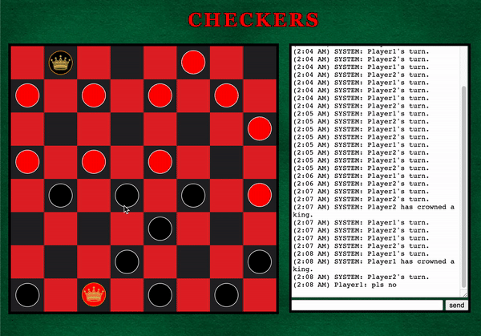

# Online Checkers

Online Checkers game developed with HTML, CSS, and vanilla JavaScript. Utilizes a 
multi-threaded web server written in Java to support multiplayer functionality. 
Also features a chat-box that displays System broadcasts and allows for messaging 
between the players and spectators.

